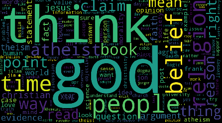
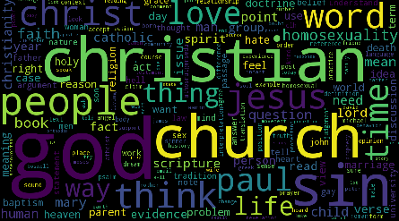
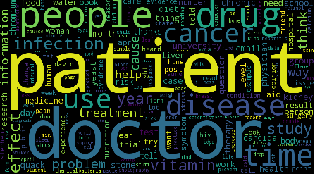
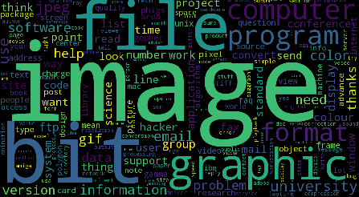
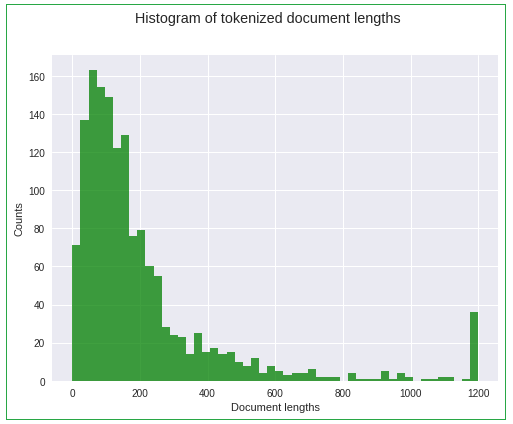
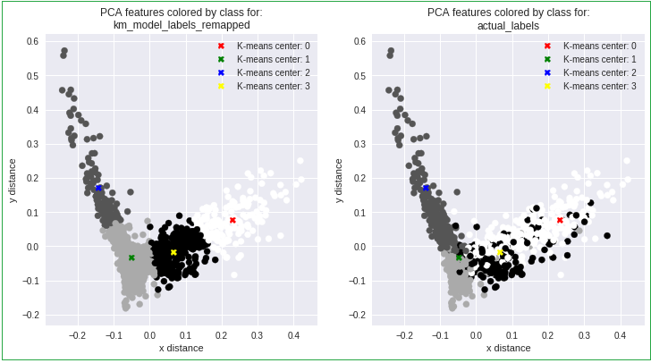

# Comparing the performance of non-supervised vs supervised learning methods for NLP text classification
by Gal Arav M.Sc.

## Notes

1. Definitions of the terms used in this article are included at the end.

2. The accompanying [python notebook is hosted at Google Colab](https://colab.research.google.com/github/gal-a/blog/blob/master/docs/notebooks/nlp/nlp_tf-idf_clustering.ipynb)

3. This is my first article on Medium and I look forward to any feedback or questions, my blog is at: http://gal-a.com/


## Input data

The input data is extracted from a subset of internet newsgroups available in the scikit learn library, shown below are the word clouds of 'hot topics' within newsgroups emphasizing the most popular topics per newsgroup.

### Atheism newsgroup word cloud:



### Christian newsgroup word cloud:



### Medical newsgroup word cloud:



### Graphics newsgroup word cloud:




## Motivation

**Our goal is to accurately classify text documents by comparing the performance metrics of unsupervised learning methods versus existing performance measures of supervised learning methods.**

We will compare the performance measures for the following non-supervised methods: K-means, NMF and LDA methods against these supervised methods: Multinomial Naive Bayes and Linear Support Vector Machine (SVM) methods.

Performance metrics for the supervised methods are detailed in scikit learn's documentation and we use them as a baseline reference (to ensure that we compare apples to apples, we will evaluate performance metrics on the exact same **test dataset** that was analysed here):  
http://scikit-learn.org/stable/tutorial/text_analytics/working_with_text_data.html


Why bother with unsupervised methods if we know that supervised methods will outperform them? This is because in many scenarios we are faced with situations where we do not have a fully labelled dataset. It can be both expensive and time-consuming to label large datasets and it is, therefore, useful to be able to get an initial angle on our investigation by finding clusters of similar documents prior to investing resources in a text labelling project. For example, if we have only a vague idea of the nature of our text data, the 'interesting' clusters of classes found by an unsupervised learning method can be used to help us decide which class labels to focus on in a subsequent supervised learning project. Semi-supervised learning methods, whereby a large unlabelled dataset is used to augment a small labelled dataset, can lead to significant improvements in classification accuracy.

---

## Pre-processing

Before we can apply the machine learning methods, we need to 'clean up' the text, in particular, we aim to: **remove punctuation**, **remove trivial 'stop-words'**, apply some basic linguistic methods such as a **stemmer** or a **lemmatizer** algorithm and limit **Parts Of Speech (POS)**. In this brief study, we experiment with leaving only the nouns in the text.

**Stemmer** algorithms work by cutting off the end or the beginning of the word, taking into account a list of common prefixes and suffixes that can be found in an inflected word.

**Lemmatizer** algorithms are more complicated and take into consideration the morphological analysis of the words by using detailed dictionaries which the algorithm can look through to link the form back to its lemma.

Below are 3 example lists of nouns extracted from the original sentences. They are by no means perfect and require more intricate pre-processing, but they are sufficiently accurate for us to progress with (and as shown earlier, the word clouds nicely reflect each of the 4 newsgroups). The original sentences:

```
* If someone >>>was bitten, how soon would medical treatment be needed, and what would >>>be liable to happen to the person?
--> Nouns: bitten treatment person

* By their own devices, they establish a new religion, a |> mythology.
--> Nouns: device religion mythology

* The conclusion from this comparison is that the central part of the traditional Roman canon was already fairly well in place by sometime in the late 4th century.
--> Nouns: conclusion comparison roman canon place century
```

Note that nltk's default POS implementation is not perfect and there are various other POS implementations to experiment with (e.g. HunPos, Stanford POS, Senna). Here we see that for the above sentences, the word 'bitten' is incorrectly classified as a noun although it is actually the past participle of 'bite' (a verb).

Machine learning models require a numerical representation of the input data and therefore we need to transform the text to a numerical format before we can apply the learning models. The most popular method used to transform text documents to a numerical representation is known as **TF-IDF**, **'Term Frequency - Inverse Document Frequency'**, and despite its long name it is quite easy to understand. **Simply put, TF-IDF is a numerical table for how often a term appears in a specific document normalized by how often it appears in all the documents in the corpus.**

Note that the 'Term Frequency' concept is commonly referred to as a 'bag of words'. When dealing with a large corpus of related text documents, often the first thing that we would like to do is to create a summary of the most popular words or phrases within these documents. The 'hot topics' can then be created from a sorted list of terms by either the Term Frequencies or the Weighted Term Frequencies (normalized by the document counts as they appear in the TF-IDF matrix)

Once the pre-processing is completed, it is helpful to plot a histogram of the tokenized document lengths.

### Histogram of tokenized document lengths:



Note the last bin represents a spike of nearly 40 counts (at document length = 1200)since this value was used for the maximum document length.

Here is a summary of the pre-processing steps that can be run in the accompanying notebook (using the sklearn library):

(i) Build count_vectorizer from the documents and fit the documents  
(ii) Build TF (Term Frequency) from the documents, this is a sparse version of the bag-of-words  
(iii) Build bag-of-words in two steps: fit, transform  
(iv) Get feature names and build dataframe version of the bag-of-words  
(v) Use TfidfTransformer to transform bag_of_words into a TF-IDF matrix (Term Frequency - Inverse Document Frequency)  
(vi) Find the most popular words and highest weights  
(vii) Build word weights as a list and sort them  
(viii) Calculate cosine similarity of all documents with themselves  
(ix) Calculate distance matrix of documents  

---

## Dimensionality reduction using PCA followed by K-means clustering

K-means is the most well-known clustering algorithm. It is an unsupervised learning method because the learning is not based on the labelled classes.

Given a set of observations (x1, x2, …, xn), where each observation is a
d-dimensional real vector, k-means clustering aims to partition the n
observations into k (≤ n) sets S = {S1, S2, …, Sk} so as to minimize the
Within-Cluster Sum of Squares (WCSS) (i.e. minimize the variance).

It can generate a good segmentation of the most popular topics across all
the documents in the corpus.

**While K-means can directly process any number of features,
it is often used after a separate pre-processing step responsible for reducing
the number of features, such as the popular PCA method (Principal Component Analysis).** There's a nice PCA implementation available in sklearn.decomposition.

**In Linear Algebra terms**, PCA can be done by eigenvalue decomposition of a data covariance (or
correlation) matrix. The resulting eigenvectors correspond to the different
directions that the data is dispersed. The eigenvalues represent the relative
importance of these eigenvectors. PCA allows us to drop the eigenvectors that
are relatively unimportant based on the ordered ranking of their corresponding
eigenvalues.

**In Statistical terms**, the fraction of variance explained by a principal component is the ratio between the variance of that principal component and the total variance (the sum of variances of all individual principal components). To estimate how many components are needed to describe the data we could examine the cumulative explained variance ratio as a function of the number of components (ordered by eigenvalue size) and select only the top components that correspond to a certain percentage (e.g. 90%) of the explained variance.

In our case, since we would like to create a 2-dimensional visualization (see below), we drop all but the two most important eigenvectors corresponding to the two
largest eigenvalues and these two remaining features serve as input to the
K-means algorithm - note that an analysis based on just 2 features will usually not contain 90% of the explained variance!

```
import numpy as np
import pandas as pd
import matplotlib.pyplot as plt
from sklearn.cluster import KMeans
from sklearn.decomposition import NMF, LatentDirichletAllocation, PCA
```

```
# Dimensionality reduction using PCA
# Reduce the tfidf matrix to just 2 features (n_components)
X = tfidf.todense()  # note that 'tfidf' is the result of the above pre-processing
pca = PCA(n_components=2)
pca.fit(X)
X_pca = pca.transform(X)

print("X_pca now has just 2 columns:")
print(X_pca[:5,:])

print("---")
print("X.shape:", np.array(X).shape)
print("X_pca.shape:", np.array(X_pca).shape)
```

```
X_pca now has just 2 columns:
[[-0.0347 -0.0534]
 [-0.0662 -0.1706]
 [-0.0179 -0.0603]
 [ 0.0316 -0.0564]
 [ 0.0166 -0.0002]]
---
X.shape: (1502, 16676)
X_pca.shape: (1502, 2)
```

```
# Note that for this simplistic dataset we don't really need to iterate
# although usually we don't know the number of topic clusters in advance!
km_model = KMeans(n_clusters=n_topic_clusters, max_iter=10, n_init=2, random_state=0)

# K-means (transform dimensions from number of features in input matrix to n_clusters)
km_model.fit(X_pca)
df_centers = pd.DataFrame(km_model.cluster_centers_, columns=['x', 'y'])

print("df_centers:")
print(df_centers)
```
```
df_centers:
        x       y
0  0.2406  0.0634
1 -0.0512 -0.0270
2 -0.1265  0.1880
3  0.0668 -0.0188
```

```
def scatter_plot_with_labels(i_plot, labels, title):
  ax = plt.subplot(1, 2, i_plot)
  ax.set_title('PCA features colored by class for:\n' + title)
  ax.set_xlabel('x distance')
  ax.set_ylabel('y distance')
  plt.scatter(X_pca[:, 0], X_pca[:, 1], c=labels, s=50, cmap='gray')

  colors = ['red', 'green', 'blue', 'yellow']
  for i,color in enumerate(df_centers.index.tolist()):
    plt.plot(df_centers['x'][i], df_centers['y'][i], 'X', label='K-means center: %d' % i, color=colors[i])

  plt.legend()

# di_actual_to_kmeans = {0:0, 1:1, 2:2, 3:3}  # no color remapping
di_actual_to_kmeans = {0:3, 1:2, 2:1, 3:0}
km_model_labels_remapped = [di_actual_to_kmeans[x] for x in km_model_labels]

plt.figure(figsize=(12,6))
scatter_plot_with_labels(1, km_model_labels_remapped, "km_model_labels_remapped")
scatter_plot_with_labels(2, actual_labels, "actual_labels")
plt.show()

```

### PCA features for K-Means Model vs Actual classes:


* K-means results in a clean segmentation of all the data points (on the left).   

* Of course, the K-Means model resulted in some classification errors as can be seen on the right (for the same data points with the actual class labels), although we can still see the 4 clusters quite clearly.

* Note that, in general, since we usually do not know the number of clusters in the data, we need to estimate this using a technique such as the popular **Elbow method**:  
https://en.wikipedia.org/wiki/Determining_the_number_of_clusters_in_a_data_set

* The dimensions of the centres are: (n_clusters, n_features).   

* The PCA was run as an initial step prior to the K-means which resulted in the above 2-dimensional representation (n_features = 2).   

## NMF and LDA clustering

Both NMF (Non-negative Matrix Factorization) and LDA (Latent Dirichlet
Allocation) clustering use a 'bag of words' matrix as input i.e. the term
frequencies associated with each document. Both algorithms then split the
original bag of words matrix into two separate ones:

1. A document to topic matrix
2. A term to topic matrix

Using the least errors method, the multiplication of these two derived matrices is
as close as possible equal to the original term
frequencies

While K-means can provide a good overall segmentation, the main advantage of
using alternative clustering methods, such as NMF and LDA, is that these methods
provide additional insight into the top ranking documents per topic cluster.
Note that all three of these algorithms require the user to specify the number of topics as an input parameter.

Note that NMF requires the TF-IDF matrix as input, whereas LDA only requires the
bag of words (the TF table) as input.

---

## Results

First, the **Adjusted Rand Index** and **Adjusted Mutual Information Score** were calculated for the Unsupervised Learning methods (see definitions at the end of this article). These are functions that measure the similarity of the two assignments, ignoring permutations and with chance normalization:

```
Adjusted Rand Index:
kmeans: 0.2972
nmf: 0.4972
lda: 0.5529
---
Adjusted Mutual Information Score:
kmeans: 0.3794
nmf: 0.5002
lda: 0.5337
```

Based on the Adjusted Rand Index and the Adjusted Mutual Information Score, the NMF and LDA methods both outperformed K-means.

In this study, the best results were achieved for the LDA algorithm (the column definitions for the sklearn.metrics table shown below are included at the end in the 'Text Processing Definitions' section).

```
LDA classifier metrics:
                        precision    recall  f1-score   support

           alt.atheism       0.64      0.79      0.70       319
         comp.graphics       0.84      0.91      0.88       389
               sci.med       0.84      0.80      0.82       396
soc.religion.christian       0.88      0.69      0.77       398

           avg / total       0.81      0.80      0.80      1502

Ordered confusion matrix:
[[251  11  24  33]
 [ 10 355  23   1]
 [ 32  45 315   4]
 [102  10  12 274]]
```
as compared to the best results for the supervised method (achieved for the Linear SVM):

```
http://scikit-learn.org/stable/tutorial/text_analytics/working_with_text_data.html

>>> from sklearn import metrics
>>> print(metrics.classification_report(twenty_test.target, predicted,
...     target_names=twenty_test.target_names))
...                                         
                        precision    recall  f1-score   support

           alt.atheism       0.95      0.81      0.87       319
         comp.graphics       0.88      0.97      0.92       389
               sci.med       0.94      0.90      0.92       396
soc.religion.christian       0.90      0.95      0.93       398

           avg / total       0.92      0.91      0.91      1502


>>> metrics.confusion_matrix(twenty_test.target, predicted)
array([[258,  11,  15,  35],
       [  4, 379,   3,   3],
       [  5,  33, 355,   3],
       [  5,  10,   4, 379]])
```
That's not bad given that we are using an Unsupervised Learning method!


## Summary
* Without 'peeking' at the class labels, we were able to get scores of just over 0.8 for mean precision, recall and f1-score using LDA for Unsupervised Learning. This compares to scores just over 0.9 using a Linear Support Vector Machine (SVM) classifier for a Supervised Learning method that trained on the actual class labels.

* In general, all the algorithms faired better in their ability to pick out the 'comp.graphics' newsgroup (i.e. this newsgroup was least confused with other newsgroups).

* The most confusion occurred between the similar 'alt.atheism' and 'soc.religion.christian' newsgroups - as we would expect.

The python notebook demonstrated the following techniques in the context of NLP (Natural Language Processing) using python's sklearn library:

* Vectorize text to a numeric matrix using TF-IDF (Term Frequency - Inverse Document Frequency)

* Dimensionality Reduction using PCA

* Unsupervised classification: Calculate K-means clusters based on PCA (a reduced version of TF-IDF)

* Unsupervised classification: Calculate NMF (Non-negative Matrix Factorization) based on TF-IDF

* Unsupervised classification: Calculate LDA (Latent Derilicht Analysis) based on TF

The next step would be to run a grid search of parameterizations of these algorithms (that might result in better classifications) and unleash them on bigger datasets.

---

## Text Processing Definitions (used in this article)

### General:

**Corpus**: A collection of written texts on a particular subject.

**Document / sample / observation**: A sequence of words in the corpus.

**Term / words / phrase / feature / n-gram**: A contiguous sequence of n items from a given sample of text (or speech). An n-gram can be of varying length e.g. unigram, bigram, trigram.

**Clusters of terms**: Topics. Classes of related terms.

**Clusters of documents**: Mixtures of topics with a common theme throughout the documents.

### Pre-processing:

**TF-IDF (Term Frequency - Inverse Document Frequency)**: A statistical measure for how important a term is to a document relative to the entire corpus. In effect, the measure normalizes how frequently a term appears in a document by
how frequently it appears in the corpus.

**TF-IDF samples**: The individual documents in the corpus, the rows in the TF-IDF matrix.

**TF-IDF features**: These are all the unique n-grams contained in the corpus, the columns in the TF-IDF matrix.

**PCA** (Principal Component Analysis): A popular statistical method for dimensionality reduction i.e. reducing the dimension of the feature space. It uses an orthogonal transformation to convert a set of samples of possibly correlated variables into a set of values of linearly uncorrelated variables called principal components.

### Supervised Learning Methods:

**Multinomial Naive Bayes**: A family of probabilistic classifiers based on applying Bayes' theorem with strong (naive) independence assumptions between the features. A multinomial distribution is used to model each of the features since this is appropriate for text data which can easily be turned into word counts. It is a popular supervised learning method for text classification that performs well despite its 'naive' assumptions.

**Support Vector Machine (SVM)**: Performs classification by finding the hyperplane that maximizes the distance margin between classes. It is a popular supervised learning method for text classification although implementations are slower than the above Naive Bayes method.

### Supervised Learning performance metrics:

**Precision**: The ratio tp / (tp + fp) where tp is the number of true positives and fp the number of false positives. The precision is intuitively the ability of the classifier not to label as positive a sample that is negative.

**Recall**: The ratio tp / (tp + fn) where tp is the number of true positives and fn the number of false negatives. The recall is intuitively the ability of the classifier to find all the positive samples.

**F1 score**: This can be interpreted as a weighted average of the precision and recall, where an F1 score reaches its best value at 1 and worst score at 0. In the multi-class and multi-label case, this is the weighted average of the F1 score of each class.

F1 score = 2 * (precision * recall) / (precision + recall)  

**Support**: The number of occurrences of each class in the target class vector.

### Unsupervised Learning Methods:

**K-means**: A popular clustering method used to partition a set of samples into
k clusters.

**NMF (Non-negative Matrix Factorization)**: A linear algebra method where a
non-negative matrix is factorized into two non-negative matrices W and H related
to the topic distributions.

**LDA (Latent Dirichlet Allocation)**: A Bayesian inference method that builds a
topic per document model and terms per topic model by using Dirichlet
distributions.

### Unsupervised Learning performance metrics:

**Note**: Whereas in Supervised Learning we obtain a direct mapping between the ground truth class vector and a predicted class vector, in Unsupervised Learning, we have no way of predicting the absolute class id and instead we obtain predictions for the relative class ids. For example, a sample containing a ground truth of 3 different class labels {0,1,2} may result in a predicted assignment of any one of 6 different permutations labelled:  
{0,1,2} or {0,2,1} or {1,0,2} or {1,2,0} or {2,0,1} or {2,1,0}  
and we are interested in the quality of the metrics of the 'best' permutation relative to the ground truth.

**Adjusted Mutual Information Score**: Mutual Information is a function that measures the agreement of the two assignments, ignoring permutations. Two different normalized versions of this measure are available, Normalized Mutual Information(NMI) and Adjusted Mutual Information(AMI). NMI is often used in the literature while AMI was proposed more recently and is normalized against chance.

**Adjusted Rand index**: The Adjusted Rand Index is a function that measures the similarity of the two assignments, ignoring permutations and with chance normalization.

For full details on these metrics see sklearn: 
http://scikit-learn.org/stable/modules/clustering.html#clustering-performance-evaluation